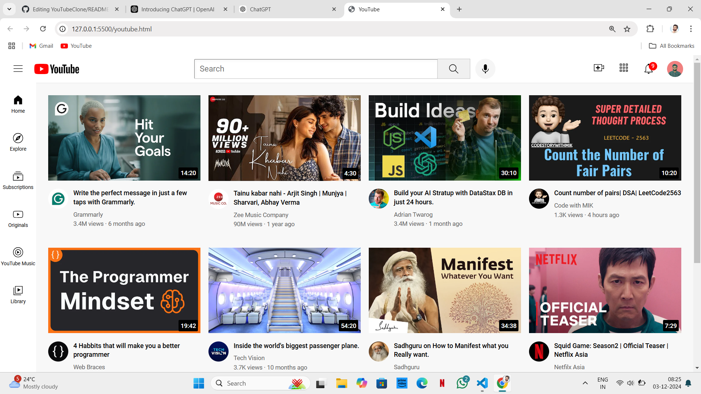

# YouTubeClone
A simple YouTube clone created using **HTML** and **CSS** to replicate the basic design and layout of the popular video-sharing platform.  
## Purpose  
This project was created to practice and showcase front-end development skills, focusing on layout design and styling without relying on JavaScript or backend functionality.  
## Technologies Used
- HTML5  
- CSS3  
## Future Improvements
- Adding interactivity with JavaScript.  
- Integrating video functionality.  
- Developing backend features using a framework.
## Screenshots

